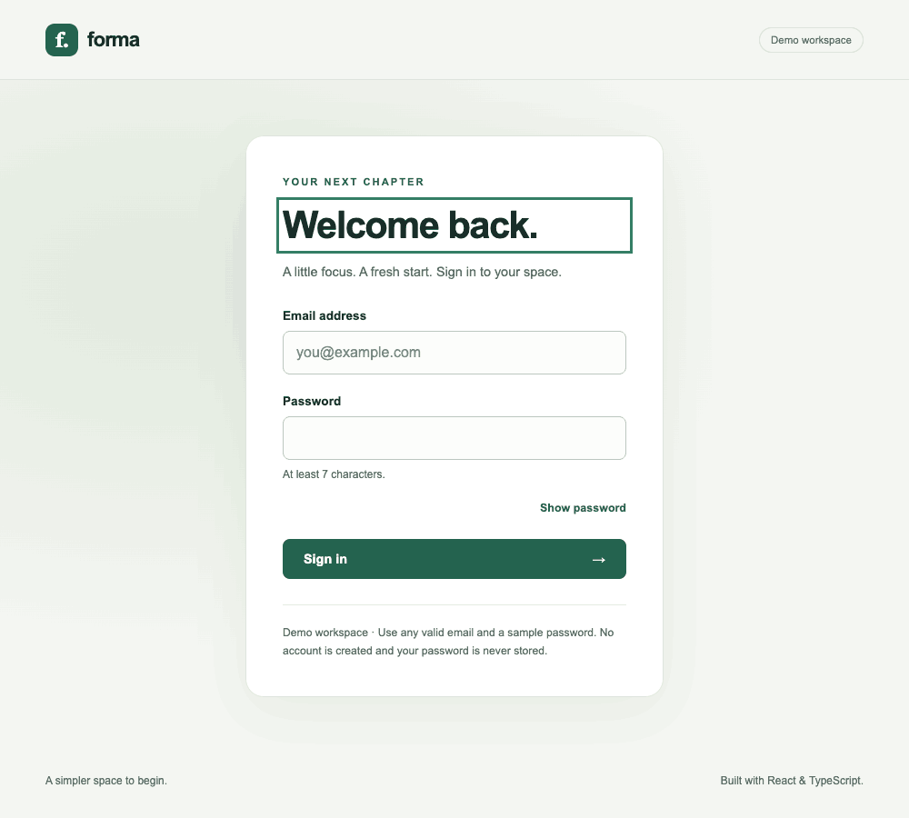

# Forma · React TypeScript Login

[](https://github.com/fatmakahveci/react-ts-login/actions/workflows/test.yml)
[](https://react.dev/)
[](https://nextjs.org/)
[](LICENSE.md)

A responsive sign-in demo built with Next.js, React, and TypeScript. Forma combines reusable UI components, accessible form feedback, and a shared demo session in a small, testable application.

**This is a client-side UI demonstration.** It does not verify identities, create accounts, or protect server resources.

## Demo



## Features

- Immediate validation using the latest field values, without a submit delay.
- Field-level error messages, accessible descriptions, and focus on the first invalid input.
- Password visibility toggle and browser autofill support.
- Keyboard focus indicators, a skip link, and focus management between views.
- Responsive sign-in and workspace screens styled with plain CSS.
- Demo session restoration, cross-tab synchronization, and an in-memory fallback when storage is blocked.
- Behavioral tests and CI checks for lint, types, tests, and production builds.

## Quick Start

Requirements: **Node.js 22.12 or newer** and **npm**. The `.nvmrc` file selects Node.js 22.

```bash
git clone https://github.com/fatmakahveci/react-ts-login.git
cd react-ts-login
npm ci
npm run dev
```

Open [localhost:3000](http://localhost:3000). No environment variables, API keys, or database setup are required.

If you use nvm, run `nvm install` and `nvm use` in the project directory before installing dependencies.

### Try the Demo

1. Enter a sample email such as `demo@example.com`.
2. Enter a sample password such as `demo-password`.
3. Select **Sign in** to open the workspace.
4. Select **Sign out** to return to the login form.

Any email matching the form's `name@example.com` pattern is accepted. Passwords must contain at least seven characters after surrounding whitespace is trimmed. Use sample credentials; no account registration is needed.

Validation messages appear after a field loses focus or the form is submitted. Once shown, they update as you correct the input.

## Commands

| Command | Purpose |
| --- | --- |
| `npm run dev` | Start the development server. |
| `npm run build` | Generate the production build. |
| `npm start` | Serve the production build. Run `npm run build` first. |
| `npm run lint` | Check source files with ESLint. |
| `npm run typecheck` | Check TypeScript without emitting files. |
| `npm test` | Run the Vitest suite once. |
| `npm run check` | Run lint, type checks, tests, and build in sequence. |

For a local production preview:

```bash
npm run build
npm start
```

## Project Structure

```text
src/
├── app/
│   ├── globals.css                  # Global styles and design tokens
│   ├── layout.tsx                   # Root layout, metadata, and context provider
│   └── page.tsx                     # Selects the login or workspace view
├── components/
│   ├── auth/
│   │   └── login-form.tsx           # Form state, validation, and submission
│   ├── layout/
│   │   ├── account-navigation.tsx   # Demo status and sign-out action
│   │   └── site-header.tsx          # Brand and account navigation
│   ├── ui/
│   │   ├── button.tsx
│   │   ├── card.tsx
│   │   └── input.tsx                # Forwarded ref and accessible field messages
│   └── workspace/
│       └── workspace-home.tsx      # Signed-in demo view
├── contexts/
│   └── auth-context.tsx            # Demo session state and persistence
└── types/
    └── ui.types.ts                 # Shared UI component props

tests/
├── auth-context.test.tsx
└── login-form.test.tsx
```

Component CSS files live beside their components. Source files and directories use `kebab-case`; React components use `PascalCase`. Shared type files use `.types.ts`, and component tests use `.test.tsx`. Next.js entry points keep their framework filenames. The `@/` import alias resolves to `src/`.

## Session Behavior and Security

The authentication context stores only an `isLoggedIn=1` flag in localStorage. The application does not persist or transmit the entered email or password.

- Reloading restores the demo state when the flag exists.
- Login and logout changes synchronize across tabs on the same origin.
- If storage is unavailable, login and logout still work in memory for the current page.

The flag is editable by the browser user and provides no authorization. A production application needs server-side identity verification and authorization before it can protect data or actions.

To report a vulnerability privately, follow the [security policy](SECURITY.md).

## Testing

Tests use **Vitest**, **React Testing Library**, and **jsdom**. They cover:

- Login, logout, session restoration, and credential persistence boundaries.
- Invalid email input, accessible errors, and invalid-field focus.
- Immediate submission and the regression where validity could become stale.
- Password visibility without form submission.
- Blocked browser storage and session changes from another tab.

Run `npm run check` before submitting changes. The [CI workflow](.github/workflows/test.yml) runs the same checks for pushes and pull requests targeting `main`.

## CI / CD

The [CI / CD workflow](.github/workflows/test.yml) runs on pull requests, pushes to `main`, and manual dispatches.

1. Install the locked dependencies on Node.js 22.
2. Fail on high or critical dependency advisories, then run lint, TypeScript, tests, and the production build.
3. Build the Docker image and verify that its HTTP endpoint and JavaScript/CSS assets are served successfully.
4. On `main` only, publish that tested image to GitHub Container Registry using the workflow's `GITHUB_TOKEN`.

The container runs as a non-root user and includes only the Next.js standalone runtime and assets. Application images use `ghcr.io/fatmakahveci/react-ts-login/app:latest` and `:sha-<full-commit-sha>`. Pull requests never publish images. The immutable commit tag identifies the version to deploy or roll back to.

```bash
# Build and check the image locally (requires Docker)
docker build -t forma:local .
bash scripts/smoke-test-container.sh forma:local

# Run a published Linux amd64 image
docker run --rm --platform linux/amd64 -p 3000:3000 ghcr.io/fatmakahveci/react-ts-login/app:latest
```

Open [localhost:3000](http://localhost:3000). If the GHCR package is private, authenticate with an account that has package read access before pulling it. Package visibility is managed in GitHub's package settings.

CD delivers a runnable image; it does not deploy to a public website or remote server. No extra deployment secrets are required for GHCR publishing. A hosting target can consume the commit-tagged image when one is configured.

The separate [source package workflow](.github/workflows/publish-source-package.yml) validates the source before publishing an OCI source archive on GitHub releases or manual dispatch. Source archives retain their existing package name, separate from runnable `/app` images. Dependabot checks npm packages, GitHub Actions, and the Docker base image weekly.

## Contributing

See the [contributing guide](.github/CONTRIBUTING.md) for the development workflow and pull request expectations. Notable changes are recorded in the [changelog](CHANGELOG.md).

## License

Licensed under the [Apache License 2.0](LICENSE.md).
