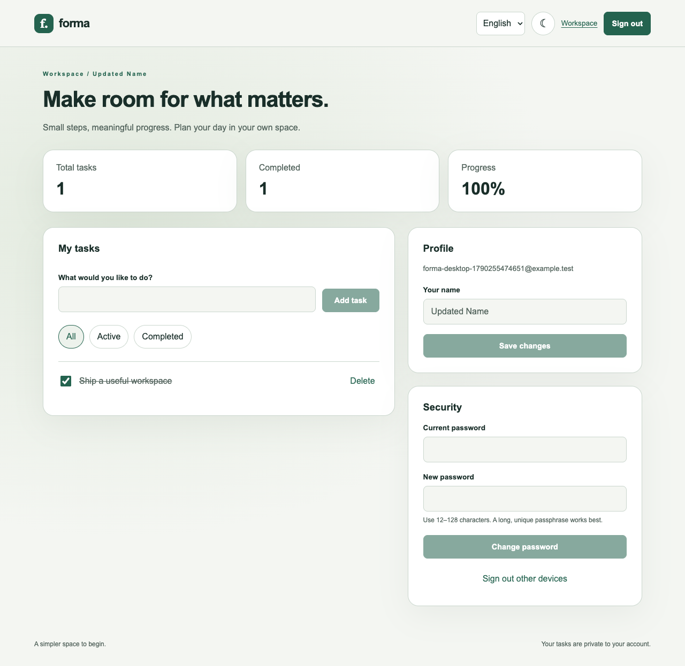

# Forma · Personal Workspace

[](https://github.com/fatmakahveci/react-ts-login/actions/workflows/test.yml)
[](LICENSE.md)

A bilingual personal workspace with verified accounts, private tasks, profile settings, and light/dark themes. Built with Next.js, React, TypeScript, Better Auth, PostgreSQL, and SMTP.

## Preview



## Features

- Email registration and verification, password sign-in, and password recovery.
- Database-backed sessions in HTTP-only cookies; protected pages and per-user task APIs.
- Private task creation, completion, filtering, and deletion (up to 200 tasks).
- Profile name changes, password changes, and revocation of other sessions.
- Turkish/English UI and persistent light/dark themes, rendered from preference cookies.
- Accessible labels, errors, loading states, keyboard focus, responsive layouts, and expired-session redirects.
- Structured server error logs with reference IDs and a database readiness endpoint.
- Real PostgreSQL/SMTP browser tests on desktop and mobile, plus CI and container delivery.

The old client-only demo login flag is no longer supported. Create and verify a real account in the configured environment; arbitrary credentials do not grant access.

## Local Setup

Use Node.js **22.22.2+ (22.x), 24.15.0+ (24.x), or 26+**, npm, and Docker Compose. `.nvmrc` selects Node.js 22.

```bash
npm ci
cp .env.example .env.local
openssl rand -base64 48
```

Paste the generated value into `BETTER_AUTH_SECRET` in `.env.local`. Keep it private. Then start the local database and test mailbox:

```bash
docker compose up -d
npm run db:migrate
npm run dev
```

Open [localhost:3000](http://localhost:3000), create an account, and open [the local mailbox](http://localhost:8025) to follow the verification link. Mailpit captures email locally; it does not deliver to external addresses.

`BETTER_AUTH_URL` must exactly match the browser origin. `localhost` and `127.0.0.1` are different origins. If using another port, update this value before starting the app.

## Configuration

| Variable | Purpose |
| --- | --- |
| `DATABASE_URL` | PostgreSQL connection string. |
| `BETTER_AUTH_URL` | Public application origin; HTTPS is required in production. |
| `BETTER_AUTH_SECRET` | Random secret of at least 32 characters; keep it stable across replicas and restarts. |
| `SMTP_HOST`, `SMTP_PORT` | Mail server connection. |
| `SMTP_USER`, `SMTP_PASSWORD` | Production SMTP credentials. |
| `SMTP_SECURE` | `true` for implicit TLS (usually port 465). |
| `SMTP_REQUIRE_TLS` | Defaults to `true`; use `false` only for a local test mailbox. |
| `MAIL_FROM` | Verified sender address. |
| `ALLOW_LOCAL_HTTP` | Local production-build testing only; never enable on a public host. |

There is no built-in SMTP service or email delivery guarantee. Production delivery needs a configured provider and a verified sender domain (including its SPF/DKIM records).

## Commands

| Command | Purpose |
| --- | --- |
| `npm run dev` | Start the development server. |
| `npm run db:migrate` | Create/update Better Auth tables and the task table. |
| `npm run check` | Lint, type-check, unit tests, and production build. |
| `npm run build` | Build the production application. |
| `npm start` | Start a local production preview after building. |
| `npm test` | Run component tests. |
| `npm run mail:test` | Start the loopback-only SMTP fixture for automated tests. |
| `npm run test:e2e` | Run desktop/mobile browser tests against the production build. |

## Browser Tests

Use a **dedicated test database**, not production. The tests create synthetic accounts and invalidate their sessions.

Set `.env.local` to a test PostgreSQL database, `BETTER_AUTH_URL=http://127.0.0.1:3100`, `ALLOW_LOCAL_HTTP=true`, `SMTP_HOST=127.0.0.1`, `SMTP_PORT=1026`, and `SMTP_REQUIRE_TLS=false`.

```bash
npm run db:migrate
npm run build
npx playwright install chromium
npm run mail:test
# In another terminal:
npm run test:e2e
```

The browser suite verifies registration, unverified-account rejection, emailed links, sign-in, private tasks, cross-account isolation, CSRF rejection, profile changes, password changes/reset, expired sessions, keyboard navigation, mobile overflow, and persistent language/theme preferences. HTML reports and failure traces stay in ignored local directories.

## Production Deployment

A ready-to-run self-hosted stack is provided in [compose.production.yml](compose.production.yml). It includes PostgreSQL with persistent storage, a one-shot migration service, a non-root application container, and Caddy for automatic HTTPS. The database and application are not exposed directly to the public network.

Requirements: a server with Docker Compose, a domain pointing to that server, inbound ports 80/443, and SMTP credentials.

```bash
cp .env.production.example .env.production
# Fill DOMAIN, secrets, SMTP credentials, and MAIL_FROM.
# Use openssl rand -hex 32 for POSTGRES_PASSWORD and BETTER_AUTH_SECRET.
docker compose --env-file .env.production -f compose.production.yml config --quiet
docker compose --env-file .env.production -f compose.production.yml up -d --build
```

Use URL-safe hexadecimal database passwords in this stack; special characters would need URL encoding in the connection string. Do not enable `ALLOW_LOCAL_HTTP` in production. Caddy provisions certificates only after DNS and network access are correct.

Before upgrading, back up the database. Keep backups outside the repository:

```bash
docker compose --env-file .env.production -f compose.production.yml exec -T database \
  pg_dump -U forma -d forma -Fc > /secure/backup/location/forma.dump
```

Review database migrations before upgrading deployed data. Restore procedures and backups should be tested on a separate database. Run one migration job before starting application replicas.

### Health and Error Tracking

`GET /api/health` returns 200 when the task schema is accessible and 503 otherwise. Docker uses it for readiness. Server failures emit JSON to stderr with an event type and reference/digest; the error UI displays a matching reference when available. Logs intentionally omit passwords, email bodies, session tokens, and query strings.

```bash
docker compose --env-file .env.production -f compose.production.yml logs --since 1h app
```

Forward container logs to your monitoring platform and configure uptime alerts for `/api/health`. No external monitoring account is configured by default.

## CI / CD

[GitHub Actions](.github/workflows/test.yml) checks dependency advisories, lint, types, unit tests, production builds, real PostgreSQL/SMTP browser flows, and a container/database smoke test. Pull requests do not publish images.

Successful `main` runs publish `ghcr.io/fatmakahveci/react-ts-login/app:latest` and `:sha-<full-commit-sha>`. The image now requires the authentication, database, and SMTP configuration above. The supplied Compose production stack builds from source so migrations and application code stay together. CD publishes an artifact; activating a public server still needs hosting credentials and DNS configuration.

## Project Structure

```text
src/app/                  # Pages and authenticated route handlers
src/components/auth/      # Login, registration, verification, and recovery UI
src/components/workspace/ # Private tasks and account settings
src/components/layout/    # Header, language/theme controls, and app shell
src/components/ui/        # Accessible interface primitives
src/contexts/             # Language and theme preferences
src/lib/server/           # Auth, PostgreSQL, SMTP, and request security
src/lib/                  # Auth client and translations
scripts/                  # Migrations, test inbox, and container checks
e2e/                      # Real account lifecycle browser tests
deploy/                   # HTTPS reverse proxy configuration
```

## Project Resources

- [Security policy](SECURITY.md)
- [Contributing guide](.github/CONTRIBUTING.md)
- [Changelog](CHANGELOG.md)
- [Apache License 2.0](LICENSE.md)
